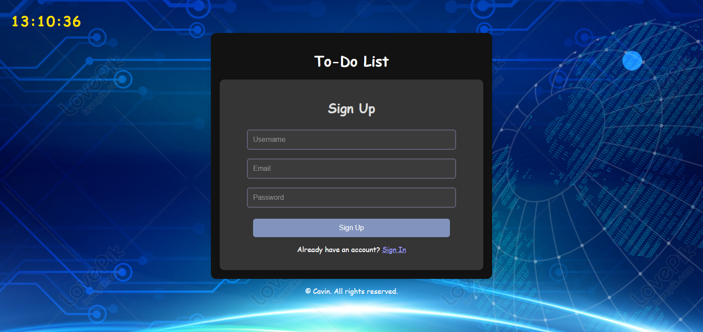

 ## To-Do List Application
A simple and interactive To-Do list web application designed to help users manage their tasks efficiently with integrated user authentication and timely reminders.
 

## ✨ Features
### 🔒 User Authentication :
Effortless Sign Up, Sign In, and Forgot Password functionalities.
Securely stores user credentials within localStorage.

### ✅ To-Do List Management :
Add tasks with specific due dates.
Mark tasks as completed, visually indicated by a strikethrough and color change.
Delete tasks with ease.
Set reminders for tasks, triggering browser notifications and an audible alert.

### ⏰ Real-time Clock :
A dynamic clock displayed at the top of the page, updating every second.

### 🔔Task Reminders & Notifications :
Each task can have an alarm set.
Upon expiration, reminders trigger an alert and an optional browser notification.

## 🚀 Installation
To get this To-Do List application up and running on your local machine, follow these simple steps:

### Prerequisites
A modern web browser (e.g., Google Chrome, Firefox, Safari).
Steps
Download the Project Files 📦:
Clone this repository or download the project's zip file.
```
git clone https://github.com/calvinkhoza/my-todo-list.git
```
## 📁 Project Structure
```
my-todo-list/
├── 📄 README.md                    # Project documentation
├── 📄 package.json                 # Node.js dependencies
├── 📄 package-lock.json            # Dependency lock file
├── 📄 server.js                    # Express server configuration
├── 📄 tasks.json                   # Task data storage
├── 🖼️ landing-page (2).png         # Landing page screenshot
├── 📁 node_modules/                # Node.js dependencies
│   ├── 📁 express/                 # Express.js framework
│   ├── 📁 nodemon/                 # Development auto-reload
│   ├── 📁 body-parser/             # Request body parsing
│   ├── 📁 cors/                    # Cross-origin resource sharing
│   └── 📁 [other dependencies]/    # Additional packages
└── 📁 public/                      # Static web assets
    ├── 🏠 index.html               # Main application page
    ├── 🎨 style.css                # Application styling
    ├── ⚡ script.js                # Client-side functionality
    ├── 🖼️ icon2.jpg                # Application icon
    ├── 🖼️ background-image.jpg     # Background image
    └── ⚙️ vercel.json              # Vercel deployment config
```
## 📄 License
This project is licensed under the MIT License - see the LICENSE file for details.
